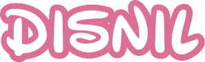
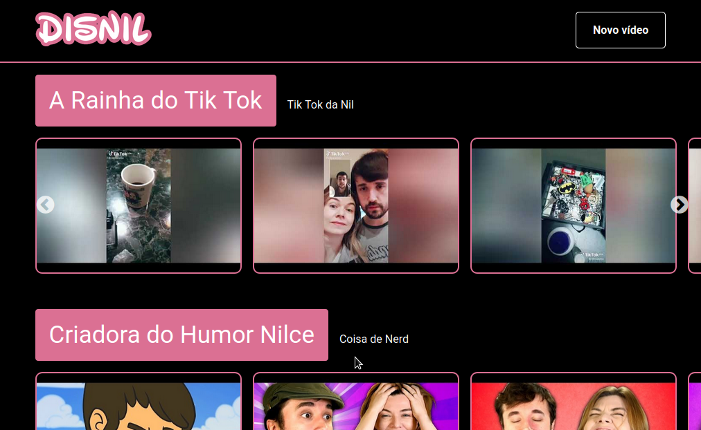
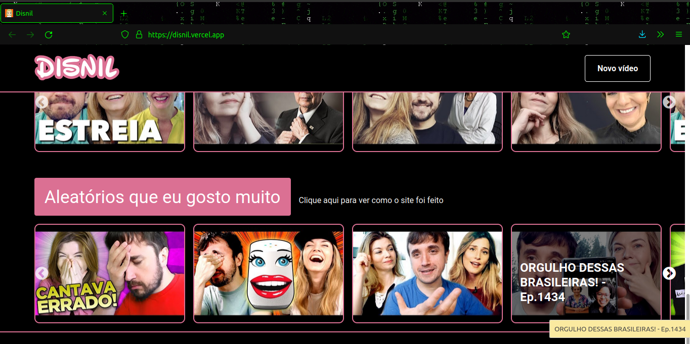

<div id="topo"></div>
<h1 align="center">
    
</h1>

<h2 align='center' >Uma Netflix da Nilce Moretto</h2>
<p align="center"><i>“Gambiarra a gente aceita, a gente não aceita a derrota" ~MORETTO, Nilce (2015)</i> </p>

<div align="center">
    
    
    
    
    
    
    
</div>

<h3 align="center">:link: <a href="https://disnil.vercel.app/">Acessar a demonstração</a>
</h3>
<h3 align="center">:link: <a href="https://github.com/Carol42/DiverStudy">Acessar meu projeto principal da Imersão React</a>
</h3>
<h4 align="center">:us::gb: <a href="./README-en.md">Go to the English version of this README »</a>
</h4>
<details>
    <summary>Sumário</summary>
    <ol>
        <li><a href="#pushpin-sobre">Sobre</a></li>
        <li><a href="#diving_mask-a-imersão">A Imersão</a></li>
        <li><a href="#hammer_and_wrench-tecnologias-utilizadas">Tecnologias utilizadas</a></li>
        <li><a href="#computer-como-baixar-e-rodar-o-projeto">Como baixar e rodar o projeto</a>
            <ul>
                <li><a href="#bulb-pré-requisitos">Pré requisitos</a></li>
            </ul>
        </li>
        <li><a href="#woman_technologist-a-desenvolvedora">A desenvolvedora</a></li>
    </ol>
</details>

## :pushpin: Sobre
A ideia desse projeto surgiu quando, em um stories no Instagram, Nilce mencionou a ideia hipotética de uma plataforma sua no estilo Netflix.

Então eu resolvi utilizar o projeto desenvolvido durante a #ImersãoReact da Alura como base para criar a Disnil.

<div align="center">
    
</div>

<p align="right"><a href="#topo"></a></p>

## :diving_mask: A Imersão

Esse projeto foi desenvolvido com base no projeto da <a href="https://www.alura.com.br/imersao-react">Imersão React</a> proposta pela <a href="https://www.alura.com.br/">Alura</a> e ministrada pelos instrutores <a href="https://twitter.com/juunegreiros">Juliana Negreiros</a>, <a href="https://twitter.com/marcobrunodev">Marco Bruno</a> e <a href="https://twitter.com/omariosouto">Mario Souto</a>, com a participação especial de <a href="https://twitter.com/paulo_caelum">Paulo Silveira</a>.

O evento ocorreu entre os dias 27 e 31 de julho de 2020 e tinha como objetivo de apresentar conceitos básicos de React para construirmos uma aplicação inspirada na Netflix. A ideia era criar o seu próprio agregado de vídeos com assuntos de seu interesse.

O projeto principal que eu desenvolvi foi o <a href="http://github.com/Carol42/DiverStudy">DiverStudy</a>, que se trata de uma coleção de vídeos didáticos e de qualidade para serem utilizados como material de apoio para estudantes e professores.

<p align="right"><a href="#topo"></a></p>

<div align="center">
    
</div>

## :hammer_and_wrench: Tecnologias utilizadas

- [React.js](https://reactjs.org/)
- [Json Server](https://www.npmjs.com/package/json-server)
- [React Router Dom](https://github.com/remix-run/react-router/tree/main/packages/react-router-dom)
- [Styled Components](https://styled-components.com/)
- [Concurrently](https://www.npmjs.com/package/concurrently)
- [prop-types](https://www.npmjs.com/package/prop-types)
- [react-slick](https://www.npmjs.com/package/react-slick)


<p align="right"><a href="#topo"></a></p>

## :computer: Como baixar e rodar o projeto

### :bulb: Pré requisitos

Antes de começar, você vai precisar ter instalado em sua máquina as seguintes ferramentas:
[Git](https://git-scm.com) e [Node.js](https://nodejs.org/en/). 

Além disso, é bom ter um editor para trabalhar com o código como o [VSCode](https://code.visualstudio.com/).

```bash
# Clonar o repositório
$ git clone https://github.com/Carol42/Disnil

# Entrar no diretório
$ cd Disnil

# Instalar as dependências
$ npm install

# Iniciar o projeto
$ npm run dev
```
<p align="right"><a href="#topo"></a></p>

## :woman_technologist: A desenvolvedora


</br>
<strong>Caroline Heloíse de Oliveira</strong>
</br>
<sup>Estudante de Engenharia de Computação (UEPG)</sup>
</br>
<a href="https://github.com/Carol42"></a>
<a href="https://linkedin.com/in/carol42"></a>
<a href="mailto:carol42.helo@gmail.com"></a>

<p align="right"><a href="#topo"></a></p>
